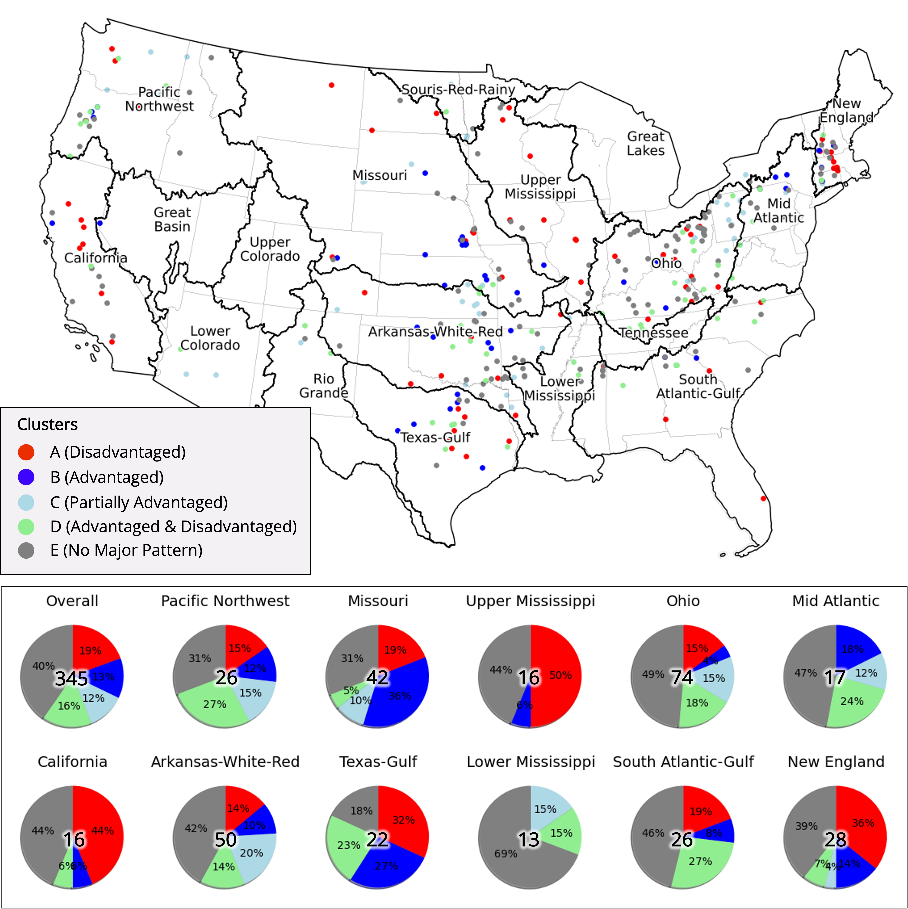

# Who is facing the potential risk of aging dam failure? Focusing on 345 dams in the conterminous United States.

Authors: TBD

Last Updated Date: May 2, 2023

## Abstract: 
Most dam infrastructure in the conterminous United States (CONUS) has exceeded their designed service lives, posing an increased risk of failures that can cause catastrophic disasters with substantial economic and human losses. However, less attention has been paid to the characteristics of at-risk populations, hindering adequate understanding and preparedness for emergency planning. Our study proposes a framework employing spatial correlation metrics to discover where and whether socially vulnerable populations are more exposed to the inundation risks induced by dam failures. By applying it to 345 dams in the CONUS, we found that socioeconomically advantaged people are more prone to incidents. In addition, we group the dams into five clusters per at-risk population characteristics to better support decision-making. Our finding suggests that dams in California and New England basin require immediate attention for repair, as they could impact socially vulnerable populations and face extreme rainfall due to climate change. 

## Keywords: 
Aging Dam, Social Vulnerability, Inundation Risk, Spatial Correlation 

## Featured Figure  

Dam locations and the portion of clusters per hydrological unit region.  
Note: point colors in the map indicate the clusters of dams. The pie charts demonstrate the percentage of clusters in each hydrological unit region, and the number in the center means dam counts in each region. 

- Out of 345 dams, each cluster has the percentage as follows: Cluster A (19%), Cluster B (13 %), Cluster C (12 %), Cluster D (16 %), and Cluster E (40 %). 
- A significant portion of dams in Upper Mississippi (50%), California (44%), New England (36%), and Texas-Gulf (32%) regions were classified as Cluster A. 
- A substantial percentage of Cluster B (i.e., dams potentially affecting advantaged populations) was observed in Missouri (36%) and Texas-Gulf (27%) regions, while its overall percentage was 13%. 
- Ohio and Arkansas-White-Red regions are the regions that have the largest and the second largest number of dams, but they provided a similar proportion of dams with the overall percentage. 